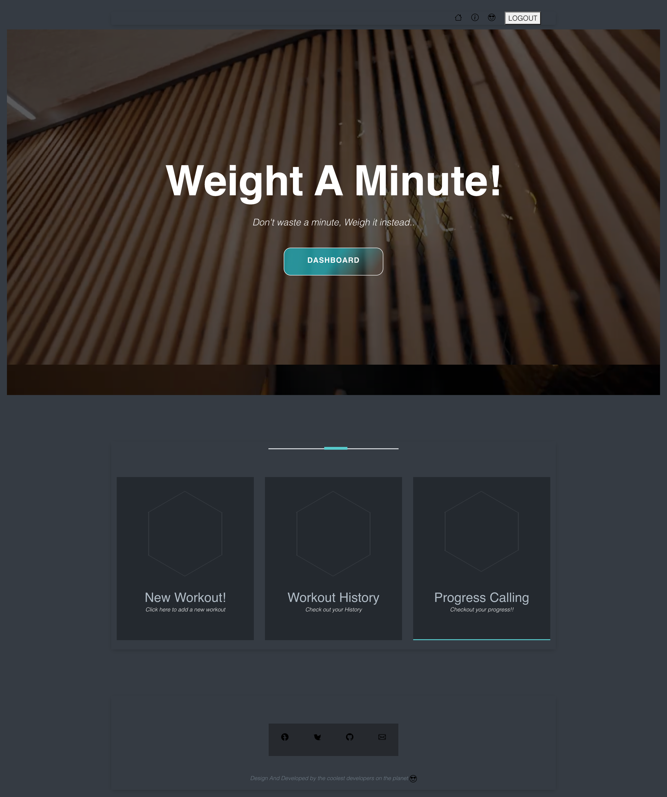

# Weight-A-Minute

Weight A Minute is a gym application that allows users to create a unique gym routine and have a saved record of their unique workouts.

## Table Of Contents

- [Usage](#Usage)
- [Screenshot](#Screenshot)
- [License](#License)
- [Technologies Used](#TechnologiesUsed)
- [Contributors](#Contributors)

## 2. Usage

Once the user accesses teh Weight A Minute application they are presented with a prompt to sign up or if they are to log in if they are a returning user. Once signed in, the user is able to select between an existing workout, creating a new workout or viewing their workout history.

## 3. Screenshot

<figure>

</figure>

##  License

This project is licensed under the MIT License.

## 4. Technologies Used

- Node js
- Express
- Heroku
- Nodemon
- MySQL/mariadb
- Docker
- Sequelize
- Dbeaver
- Bcrypt
- Postman
- S3/aws
- Chart.js
- Handlebars
- CSS
- Javascript

## 5. Contributors

- Humma Noshine <a href="https://github.com/HummaNosh">GitHub</a>
- Daniel Bowen: <a href="https://github.com/djbowen95">GitHub</a>
- Sumaya Gure: <a href="https://github.com/SuM949">GitHub</a>
- Fatumo Abdullahi: <a href="https://github.com/Fatumoabdullahi">GitHub</a>
